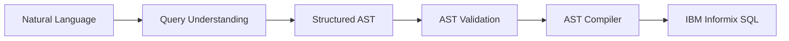

# 🚀 DataNex AI

⚠️ Beta Release

An AI-powered SQL generation engine that transforms natural language into
production-ready IBM Informix SQL through a structured AST-based compiler
pipeline.

## Project Overview

Writing SQL queries can be time-consuming, especially when working with
large databases or database-specific dialects such as IBM Informix.

DataNex AI simplifies this process by transforming natural language requests 
into structured Abstract Syntax Trees (ASTs), which are then compiled into 
clean, production-ready IBM Informix SQL.

Unlike systems that generate SQL directly from prompts, DataNex AI follows 
a structured compilation pipeline that separates query understanding from SQL
generation. This architecture improves maintainability, testability,
and long-term reliability while making it easier to extend the compiler
with new SQL capabilities.

The project is built on software engineering best practices,
including regression testing, modular architecture, and comprehensive
documentation, providing a solid foundation for future growth.

By combining artificial intelligence with a structured compiler architecture, 
DataNex AI delivers reliable SQL generation while providing a solid foundation for future growth.

screenshots/UI.png

## Key Features

- **Natural Language to SQL**
  - Converts natural language requests into production-ready IBM Informix SQL.

- **Structured AST Pipeline**
  - Uses a structured Abstract Syntax Tree (AST) to clearly separate query understanding from SQL generation.

- **IBM Informix Support**
  - Generates SQL using Informix-specific syntax, including features such as `FIRST` instead of `LIMIT`.

- **Regression-Tested Compiler**
  - Protected by a growing Golden Test suite to ensure stable and predictable SQL generation.

- **Modular Architecture**
  - Designed with independent components that simplify maintenance, testing, and future enhancements.

- **Secure Query Generation**
  - Includes validation layers and safeguards against unsupported or unsafe SQL generation.

- **Developer-Friendly**
  - Well-structured codebase, comprehensive documentation, and engineering-focused design.
  
  
## Why DataNex AI?

Many AI-powered SQL generators translate natural language directly into
SQL. While this approach can produce useful SQL, it tightly couples query 
understanding with SQL generation, making the system harder 
to validate, test, and extend.

DataNex AI follows a different approach.

Instead of generating SQL directly, the project separates the process
into well-defined stages. Each stage has a single responsibility,
resulting in a compiler that is easier to understand, maintain, test,
and evolve.

```text
Natural Language
        │
        ▼
 Intent Detection
        │
        ▼
 Query Planning
        │
        ▼
      AST
        │
        ▼
 Query Validation
        │
        ▼
 SQL Compiler
        │
        ▼
 IBM Informix SQL
```

Each stage is independently testable and focuses on a single responsibility, 
enabling DataNex AI to evolve without compromising the reliability of 
previously supported SQL generation.

### Query Processing Pipeline

**Natural Language**

The user describes the required query using plain English without
needing to know SQL syntax.

**Query Understanding**

The request is analyzed to identify tables, columns, filters,
aggregations, joins, sorting, and other query components.

**Structured AST**

The extracted intent is transformed into a structured Abstract Syntax
Tree (AST), providing a database-independent representation of the
query before SQL generation.

**AST Validation**

The generated AST is validated to detect inconsistencies before it
reaches the compiler, ensuring that only valid query structures are
compiled.

**AST Compiler**

The validated AST is compiled into clean, readable, production-ready
IBM Informix SQL using a deterministic compilation process.

By separating query understanding from SQL generation, DataNex AI
achieves a modular architecture that is easier to validate, regression
test, maintain, and extend.

This layered design allows new SQL capabilities to be introduced with
confidence while preserving the stability of existing compiler behavior.

> **DataNex AI is not simply an AI that generates SQL.  
> It is a structured SQL compilation engine powered by AI.**

## Architecture Overview

DataNex AI follows a layered architecture that separates query
understanding, validation, and SQL generation into independent stages.

This design improves maintainability, simplifies testing, and allows
new capabilities to be added without affecting existing compiler
behavior.



### Layer Responsibilities

| Stage | Responsibility |
|--------|----------------|
| **Natural Language** | Receives the user's request in plain English. |
| **Query Understanding** | Extracts tables, columns, filters, aggregations, joins, sorting, and other query elements. |
| **Structured AST** | Converts the extracted intent into a structured, database-independent representation. |
| **AST Validation** | Verifies the AST before compilation to ensure structural consistency. |
| **AST Compiler** | Generates clean, deterministic, production-ready IBM Informix SQL. |
| **IBM Informix SQL** | Final SQL output ready for execution. |

## Getting Started

Follow the steps below to set up and run DataNex AI locally.

### Prerequisites

Before getting started, make sure you have the following installed:

- Python 3.10 or later
- Git
- A valid Groq API key

> **Note**
>
> DataNex AI generates IBM Informix SQL and does not require a running
> database server to explore the SQL generation process.

### Installation

Clone the repository:

```bash
git clone https://github.com/SalahAbouElGhar/DataNex-AI.git
```

Navigate to the project directory:

```bash
cd DataNex-AI
```

Install the required dependencies:

```bash
pip install -r requirements.txt
```

### Configure Environment

Create a `.env` file in the project root and configure the required environment variables:

```text
GROQ_API_KEY=your_api_key_here
GROQ_MODEL_NAME=llama-3.1-8b-instant
MAX_HISTORY=10
```

Where:

| Variable          | Description                                                                                                                                       |
| ----------------- | ------------------------------------------------------------------------------------------------------------------------------------------------- |
| `GROQ_API_KEY`    | Your Groq API key used to access the language model.                                                                                              |
| `GROQ_MODEL_NAME` | The Groq model used for query generation. The default configuration uses `llama-3.1-8b-instant`, but any compatible Groq model can be configured. |
| `MAX_HISTORY`     | Maximum number of conversation turns retained in the session history.                                                                             |

The current Beta release has been developed and tested using the llama-3.1-8b-instant model. 
Other compatible Groq models may also work, but this model is the recommended default for this release.


### Run the Application

Start the FastAPI server:

```bash
uvicorn main:app --reload
```

### Open in Your Browser

After the server starts, open:

```
http://127.0.0.1:8000
```

The DataNex AI web interface will be available in your browser, 
allowing you to start generating IBM Informix SQL from natural language queries.

## Example Usage

The following example demonstrates how DataNex AI transforms a natural
language request into production-ready IBM Informix SQL.

### Natural Language Request

```text
total production by factory
```

### Generated SQL

```sql
SELECT
  pt.factory_id,
  SUM(pt.qty) AS total_qty

FROM prod_tbl pt

GROUP BY
  pt.factory_id

ORDER BY
  total_qty DESC
```

Every SQL statement shown above is generated deterministically from
a validated AST rather than being generated directly by the language
model.

Additional query scenarios and compiler behaviors are verified by the
project's Golden Test regression suite.

screenshots/result.png

## Project Structure

DataNex AI is organized into modular components, each responsible for a
specific stage of the SQL generation pipeline. This separation improves
maintainability, simplifies testing, and allows individual components to
evolve independently as the project grows.

```text
DataNex-AI/
│
├── ai/                 # AI interaction and prompt management
├── api/                # FastAPI routes and API endpoints
├── compiler/           # Query planning and SQL compilation
├── core/               # Configuration, logging, and security
├── logs/               # Application log files
├── models/             # Pydantic data models
├── schema/             # Schema analysis and metadata utilities
├── screenshots/        # Project screenshots
├── static/             # CSS and JavaScript assets
├── templates/          # HTML templates
├── tests/              # Golden Test regression suite
├── utils/              # Shared utility functions
├── validators/         # Query validation
│
├── main.py
├── .env.example
├── .gitignore
├── CHANGELOG.md
├── README.md
├── requirements.txt
└── start.sh
```

### Directory Responsibilities

| Directory / File | Responsibility |
|------------------|----------------|
| `ai/` | Handles AI interaction, prompt construction, and communication with the language model. |
| `api/` | Defines the FastAPI endpoints exposed by the application. |
| `compiler/` | Converts structured query representations into IBM Informix SQL. |
| `core/` | Contains shared application configuration, logging, and security utilities. |
| `logs/` | Stores application log files generated during execution. |
| `models/` | Defines Pydantic models used by the API. |
| `schema/` | Provides schema analysis and metadata helper functions. |
| `screenshots/` | Contains screenshots used in the project documentation. |
| `static/` | Stores JavaScript and CSS resources for the web interface. |
| `templates/` | Contains HTML templates rendered by FastAPI. |
| `tests/` | Contains the Golden Test regression suite and testing documentation. |
| `utils/` | Provides reusable helper functions shared across the project. |
| `validators/` | Validates query plans before SQL compilation. |
| `main.py` | Application entry point. |
| `README.md` | Project overview and user documentation. |
| `CHANGELOG.md` | Records notable changes between releases. |
| `requirements.txt` | Lists the project's Python dependencies. |
| `.env.example` | Template for required environment variables. |

The modular architecture allows each component to be developed,
tested, and maintained independently while keeping the overall SQL
generation pipeline clean, extensible, and easy to understand.

## Testing

DataNex AI is developed with a strong emphasis on reliability and
regression protection.

Instead of relying solely on manual verification, the project uses a
Golden Test regression suite to ensure that every approved compiler
behavior remains stable as the codebase evolves.

Each Golden Test defines the expected SQL generated from a specific AST.
Whenever the compiler is modified, the generated SQL is compared against
the approved output to detect unintended behavioral changes.

### Running the Test Suite

Execute the complete regression suite using:

```bash
python -m pytest tests/test_ast_compiler.py -v -s
```

A successful test run confirms that the current implementation remains
consistent with the approved compiler behavior.

### Current Coverage

The current Golden Test suite verifies compiler behavior for:

- Raw SELECT queries
- Aggregation functions (`SUM`, `AVG`, `MAX`, `MIN`, `COUNT`)
- `COUNT(DISTINCT)`
- `GROUP BY`
- `HAVING`
- Relative date filters (Today, Yesterday, This Month, This Year)
- `FIRST` (Top N)
- SQL ordering
- Table aliases

The regression suite continues to grow as new compiler capabilities are
implemented.

For a complete description of the testing philosophy, Golden Tests,
naming conventions, and best practices, see:

`tests/testing_guidelines.md`

## Roadmap

DataNex AI is an evolving project. The following roadmap outlines the
planned direction of development while maintaining the project's focus
on reliability, modularity, and high-quality SQL generation.

### Beta

- [x] Natural language to IBM Informix SQL
- [x] AST-based SQL compilation
- [x] Query validation
- [x] Golden Test regression suite
- [x] Modular compiler architecture
- [x] Comprehensive project documentation

### Version 1.0

- [ ] Multi-table query support
- [ ] Advanced JOIN reasoning
- [ ] Expanded SQL function support
- [ ] Improved natural language understanding
- [ ] Larger Golden Test coverage

### Future Releases

- [ ] Database connectivity
- [ ] Interactive schema discovery
- [ ] Conversation history
- [ ] User authentication
- [ ] Web deployment
- [ ] SaaS platform

The roadmap reflects the current direction of the project and 
will continue to evolve as new compiler capabilities and 
architectural improvements are introduced.

## Contributing

Contributions are welcome and greatly appreciated.

Whether you are fixing a bug, improving documentation, expanding the
Golden Test suite, or introducing new compiler capabilities, every
contribution helps DataNex AI become more reliable and useful.

Before submitting a contribution, please ensure that:

- The code follows the existing project structure and coding style.
- New compiler behavior is accompanied by appropriate Golden Tests.
- Existing Golden Tests continue to pass.
- Documentation is updated when introducing significant changes.

DataNex AI values correctness over complexity.

Improvements should preserve the reliability, readability, and
maintainability of the compiler while keeping the SQL generation process
deterministic and easy to validate.

Before opening a pull request, please run the complete regression suite:

```bash
python -m pytest tests/test_ast_compiler.py -v -s
```

Well-tested contributions are always preferred over large,
untested feature additions.

Every contribution should improve the project without compromising 
the reliability of previously approved compiler behavior.

## Author

Developed and maintained by Salah Abou El-Ghar.

## Acknowledgements

The development of DataNex AI benefited from AI-assisted design
discussions, documentation refinement, and technical reviews provided
through OpenAI's ChatGPT.

The project architecture, implementation, testing, and final technical
decisions remain the work of the project author.

## License

This project is licensed under the MIT License.

See the `LICENSE` file for details.

