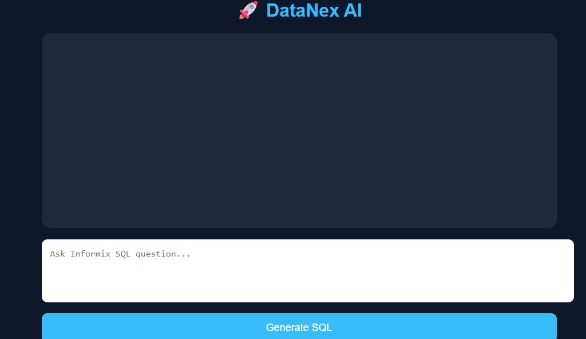
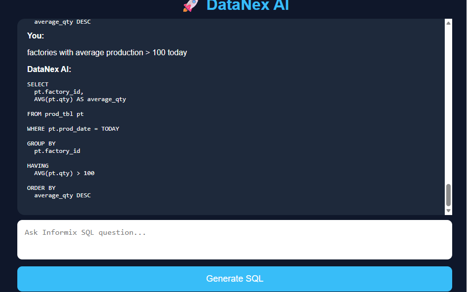

# ًںڑ€ DataNex AI

âڑ ï¸ڈ Beta Release

An AI-powered **Business Reasoning Engine** that transforms natural language requests into business
decisions, structured query plans, and validated IBM Informix SQL through a deterministic AST-based
compilation pipeline.

## Project Overview

Writing SQL queries can be time-consuming, especially when working with
large databases or database-specific dialects such as IBM Informix.

DataNex AI addresses this challenge by interpreting natural language requests
through a structured business reasoning pipeline. The system identifies
business meaning, extracts relevant facts, makes explicit business decisions,
and builds a database-aware query plan before producing a structured
Abstract Syntax Tree (AST).

The AST is then validated and compiled into clean, deterministic IBM Informix
SQL using a dedicated SQL compiler.

Unlike systems that translate prompts directly into SQL, DataNex AI separates
language understanding, business reasoning, query planning, AST construction,
validation, and SQL compilation into distinct architectural stages.

This separation improves maintainability, testability, reliability, and
traceability while making it easier to extend the system with new business
rules and SQL capabilities.

The project is built around software engineering principles such as clear
module responsibilities, deterministic compilation, Golden Tests,
end-to-end regression testing, and structured documentation.

By combining artificial intelligence with a structured reasoning and compiler
architecture, DataNex AI provides a foundation for consistent and extensible
natural-language interaction with IBM Informix SQL and database schemas.




## Key Features

* **Natural Language Understanding**

  * Interprets natural language requests and extracts the business facts required to process the request.

* **Business Reasoning**

  * Separates business meaning from database-specific implementation details.
  * Resolves business objectives, measures, dimensions, aggregations, time filters, and ranking or selection requirements.

* **Business Decision Layer**

  * Represents the interpreted request as an explicit business decision before query planning begins.

* **Database-Aware Query Planning**

  * Maps business decisions to database semantics such as tables, columns, relationships, dates, measures, aliases, ordering, and query structure.

* **Structured AST Pipeline**

  * Represents the planned query as a structured Abstract Syntax Tree (AST) before SQL compilation.

* **Deterministic IBM Informix SQL Compiler**

  * Compiles validated AST structures into clean IBM Informix SQL using Informix-specific syntax such as `FIRST` instead of `LIMIT`.

* **Multi-Table and Relationship Support**

  * Supports multiple tables, relationship discovery, JOIN planning, aliases, and display-column selection.

* **Aggregation and Query Semantics**

  * Supports `SUM`, `COUNT`, `AVG`, `MIN`, and `MAX`, together with `GROUP BY` and `HAVING` behavior.

* **Ranking and Selection**

  * Supports Top N, Bottom N, Latest N, and First N query requirements with appropriate ordering and Informix `FIRST N` semantics.

* **Regression-Tested Behavior**

  * Uses Golden Tests for deterministic compiler behavior and end-to-end regression tests to protect business and semantic behavior.

* **Modular Architecture**

  * Organizes the system by clear architectural responsibilities, making the codebase easier to maintain, test, and evolve.

* **Developer-Friendly**

  * Includes structured documentation, testing guidelines, regression specifications, and explicit architectural principles.

## Why DataNex AI?

Many AI-powered SQL generators translate natural language directly into
SQL. While this approach can produce useful SQL, it tightly couples language
understanding with SQL generation, making the system harder to validate,
test, explain, and extend.

DataNex AI follows a different approach.

Instead of treating SQL generation as a single AI step, DataNex separates the
process into well-defined architectural stages. Natural language is first
normalized and interpreted, relevant facts are extracted, business meaning
is resolved, and an explicit business decision is created before any
database-specific query structure is introduced.

The resulting query plan is then represented as a structured Abstract Syntax
Tree (AST), validated, and compiled deterministically into IBM Informix SQL.

This separation gives each stage a clear responsibility and makes the system
easier to understand, test, maintain, and evolve.

```text
Natural Language
        │
        â–¼
    Normalization
        │
        â–¼
  Fact Extraction
        │
        â–¼
  Reasoning Facts
        │
        â–¼
 Business Reasoning
        │
        â–¼
 Business Decision
        │
        â–¼
  Query Planning
        │
        â–¼
       AST
        │
        â–¼
    Validation
        │
        â–¼
   SQL Compiler
        │
        â–¼
 IBM Informix SQL
```

Each stage can be tested according to its architectural responsibility.
This allows DataNex AI to evolve while preserving previously approved
business behavior and deterministic SQL generation.

### Query Processing Pipeline

**Natural Language**

The user describes the required business request using plain English without
needing to know SQL syntax.

**Normalization**

The input is normalized into a consistent representation suitable for
downstream fact extraction and reasoning. Normalization prepares the language
without making business decisions.

**Fact Extraction**

Relevant facts are extracted from the normalized request and available
contexts. These may include the requested measure, aggregation function,
grouping dimensions, time filter, ranking strategy, intent, and other
reasoning facts.

**Reasoning Facts**

Extracted facts provide the factual representation consumed by the reasoning
layers. Facts describe what was discovered from the request and context; they
do not themselves define how the database should execute the request.

**Business Reasoning**

Business Reasoning interprets the available facts according to business rules.
It determines the business meaning of the request without depending on
database-specific column names, SQL syntax, or execution details.

**Business Decision**

The interpreted request is represented as an explicit business decision.
The decision describes what the user wants in business terms, including the
business objective, entities, measure, aggregation, grouping, ranking,
ordering, and time requirements.

**Query Planning**

The business decision is mapped to database-aware semantics. Query Planning
resolves tables, columns, relationships, aliases, date columns, measures,
ordering requirements, and other execution-related details required to build
the query structure.

**AST**

The planned query is represented as a structured Abstract Syntax Tree (AST).
The AST captures the decided query structure in a deterministic form before
SQL generation.

**Validation**

The AST is validated before compilation so that invalid or inconsistent query
structures are detected before reaching the SQL compiler.

**SQL Compiler**

The validated AST is compiled deterministically into clean IBM Informix SQL,
using Informix-specific syntax and execution semantics.

By separating normalization, fact extraction, business reasoning, business
decisions, query planning, AST construction, validation, and SQL compilation,
DataNex AI keeps each architectural stage focused on a clear responsibility.

This separation makes the system easier to understand, test, maintain, and
extend while protecting previously approved business behavior.

## Architecture Overview

DataNex AI follows a layered architecture designed to separate language
understanding, business reasoning, database-aware query planning, structured
query representation, validation, and SQL compilation.

Each layer has a clear architectural responsibility and communicates with the
next layer through explicit data structures and contracts.


```mermaid
flowchart LR

    A[Natural Language]
        --> B[Normalization]

    B
        --> C[Fact Extraction]

    C
        --> D[Reasoning Facts]

    D
        --> E[Business Reasoning]

    E
        --> F[Business Decision]

    F
        --> G[Query Planning]

    G
        --> H[AST]

    H
        --> I[Validation]

    I
        --> J[SQL Compiler]

    J
        --> K[IBM Informix SQL]
```

### Layer Responsibilities

| Stage                  | Responsibility                                                                                                                            |
| ---------------------- | ----------------------------------------------------------------------------------------------------------------------------------------- |
| **Natural Language**   | Receives the user's request in natural language.                                                                                          |
| **Normalization**      | Prepares the input in a consistent representation without interpreting its business meaning.                                              |
| **Fact Extraction**    | Discovers relevant facts such as intent, measure, dimensions, aggregation, time filters, and ranking requirements.                        |
| **Reasoning Facts**    | Provides the factual representation consumed by the reasoning layers.                                                                     |
| **Business Reasoning** | Interprets the discovered facts according to business rules and determines business meaning.                                              |
| **Business Decision**  | Represents the requested behavior as an explicit business-level decision.                                                                 |
| **Query Planning**     | Resolves database-aware semantics such as tables, columns, relationships, aliases, dates, measures, ordering, and execution requirements. |
| **AST**                | Represents the planned query structure in a deterministic, structured form.                                                               |
| **Validation**         | Verifies the AST before SQL compilation.                                                                                                  |
| **SQL Compiler**       | Converts the validated AST into deterministic IBM Informix SQL.                                                                           |
| **IBM Informix SQL**   | Final SQL representation generated from the validated AST.                                                                                |
## Getting Started

Follow the steps below to set up and run DataNex AI locally.

### Prerequisites

Before getting started, make sure you have the following installed:

* Python 3.10 or later
* Git
* A valid Groq API key

> **Note**
>
> DataNex AI generates and validates IBM Informix SQL locally and does not
> require a running Informix database server to explore the SQL generation
> process.

### Installation

Clone the repository:

```bash
git clone https://github.com/SalahAbouElGhar/DataNex-AI.git
```

Navigate to the project directory:

```bash
cd DataNex-AI
```

Install the required dependencies:

```bash
pip install -r requirements.txt
```

### Configure Environment

Create a `.env` file in the project root and configure the required
environment variables:

```text
GROQ_API_KEY=your_api_key_here
GROQ_MODEL_NAME=llama-3.1-8b-instant
MAX_HISTORY=10
```

Where:

| Variable          | Description                                                                        |
| ----------------- | ---------------------------------------------------------------------------------- |
| `GROQ_API_KEY`    | Groq API key used to access the configured language model.                         |
| `GROQ_MODEL_NAME` | Model used by DataNex AI for natural-language interpretation and query generation. |
| `MAX_HISTORY`     | Maximum number of conversation turns retained in the session history.              |

The Beta release has been developed and tested using the
`llama-3.1-8b-instant` model.

Other compatible Groq models may work, but model compatibility depends on
the configured model and the current implementation.

### Run the Application

Start the FastAPI server:

```bash
uvicorn main:app --reload
```

### Open in Your Browser

After the server starts, open:

```text
http://127.0.0.1:8000
```

The DataNex AI web interface will be available in your browser, allowing you
to submit natural-language business requests and inspect the resulting
IBM Informix SQL.

## Current Capabilities

* ✅ Natural language business-request understanding
* ✅ Structured normalization and fact extraction
* ✅ Business reasoning and explicit business decisions
* ✅ Database-aware query planning
* ✅ Single-table and multi-table queries
* ✅ Automatic INNER JOIN generation
* ✅ Relationship discovery
* ✅ Table aliases and display-column resolution

  * Examples: product name, customer name
* ✅ Aggregation

  * `SUM`
  * `COUNT`
  * `AVG`
  * `MIN`
  * `MAX`
* ✅ `GROUP BY` and `HAVING`
* ✅ Relative time-based filtering
* ✅ Ranking and selection

  * Top N
  * Bottom N
  * Latest N
  * First N
* ✅ Informix-specific SQL generation

  * Uses `FIRST N` rather than `LIMIT`
* ✅ Structured AST construction
* ✅ AST validation
* ✅ Deterministic AST-to-IBM Informix SQL compilation
* ✅ Golden Test regression suite
* ✅ End-to-end regression coverage for business and query behavior

## Example Usage

DataNex AI converts natural language business requests into validated
IBM Informix SQL through a structured reasoning and compilation pipeline.

### Option 1 — Using the Built-in Demo Schemas

For supported demonstration domains such as Sales or Production, simply enter
a natural language request:

```text
total production by product name
```

DataNex AI interprets the request, resolves the required business meaning,
selects the appropriate demo schema, discovers relevant table relationships,
plans the required JOINs, and compiles the resulting query structure into
IBM Informix SQL.

### Option 2 — Using Your Own Database Schema

For your own database, provide the schema at the beginning of the session:

```text
table prod_tbl
columns
factory_id
prod_id
prod_date
qty

table prod_desc
columns
prod_id
prod_name
```

Then ask your question naturally:

```text
total production by factory
```

DataNex AI uses the provided schema to resolve the required database
semantics and generates validated IBM Informix SQL for subsequent requests
within the current session.

> **Current Beta Behavior**
>
> * Built-in demo schemas are used automatically for supported demonstration domains.
> * Custom database schemas are provided once per session.
> * Schema and relationship information are used during database-aware query planning.
> * Future versions may support automatic schema discovery from IBM Informix system catalogs.

### Generated SQL

For the request:

```text
total production by factory
```

DataNex AI produces:

```sql
SELECT
  pt.factory_id,
  SUM(pt.qty) AS total_qty

FROM prod_tbl pt

GROUP BY
  pt.factory_id

ORDER BY
  total_qty DESC
```

The SQL is not generated directly from the natural-language request.

Instead, DataNex AI first resolves the business meaning and creates an
explicit business decision. Query Planning then maps that decision to
database-aware semantics, which are represented as a structured AST.

The validated AST is finally compiled deterministically into IBM Informix SQL.

This separation allows business reasoning and SQL compilation to evolve
independently while preserving approved query behavior.

Additional query scenarios and compiler behaviors are protected by the
project's Golden Test regression suite and end-to-end regression coverage.



## Project Structure

DataNex AI is organized by clear architectural responsibilities.
The project structure reflects the separation between AI interaction, business reasoning,
 context preparation, query planning, validation, and SQL compilation.

```text
DataNex-AI/
│
├── ai/
│   ├── ai_engine.py
│   └── prompts.py
│
├── api/
│   └── routes.py
│
├── compiler/
│   ├── ast_compiler.py
│   ├── query_ast.py
│   └── sql_generator.py
│
├── context/
│   ├── database_context.py
│   ├── knowledge_context.py
│   └── reasoning_context.py
│
├── core/
│   ├── config.py
│   ├── logger.py
│   └── security.py
│
├── knowledge/
│   ├── business_constants
│   └── business_keywords
│
├── logs/
│   └── app.log
│
├── models/
│   └── schemas.py
│
├── reasoning/
│   ├── business_facts.py
│   ├── business_reasoning.py
│   ├── measure_reasoning.py
│   └── sql_reasoning.py
│
├── schema/
│   └── schema_utils.py
│
├── screenshots/
│   ├── result.png
│   └── UI.png
│
├── specification/
│   └── REGRESSION_TEST_RANKING_SELECTION.md
│
├── static/
│   ├── app.js
│   └── style.css
│
├── templates/
│   └── index.html
│
├── tests/
│   ├── data/
│   │   ├── regression_test_cases.py
│   │   ├── test_cases.py
│   │   └── test_fixtures.py
│   │
│   ├── test_ast_compiler.py
│   ├── test_regression_ranking_selection.py
│   ├── TEST_INDEX.md
│   └── testing_guidelines.md
│
├── utils/
│   ├── normalization.py
│   ├── sql_utils.py
│   └── text_utils.py
│
├── validators/
│   └── validators.py
│
├── main.py
├── .env.example
├── .gitignore
├── CHANGELOG.md
├── DESIGN_PRINCIPLES.md
├── LICENSE
├── README.md
├── requirements.txt
└── start.sh
```

### Directory Responsibilities

| Directory / File           | Responsibility                                                                                    |
| -------------------------- | ------------------------------------------------------------------------------------------------- |
| **`ai/`**                  | AI interaction and prompt-related functionality.                                                  |
| **`api/`**                 | FastAPI routes and API-facing application endpoints.                                              |
| **`compiler/`**            | Structured query representation and deterministic SQL compilation.                                |
| **`context/`**             | Prepares and separates database, knowledge, and reasoning contexts used by downstream processing. |
| **`core/`**                | Application configuration, logging, and security-related infrastructure.                          |
| **`knowledge/`**           | Business constants and business vocabulary used by the reasoning pipeline.                        |
| **`logs/`**                | Application log output.                                                                           |
| **`models/`**              | Shared application and data schemas.                                                              |
| **`reasoning/`**           | Fact extraction, business reasoning, measure reasoning, and query reasoning.                      |
| **`schema/`**              | Database schema parsing and schema-related utilities.                                             |
| **`screenshots/`**         | Project interface and generated-result screenshots used in documentation.                         |
| **`specification/`**       | Written specifications for approved regression behavior.                                          |
| **`static/`**              | Front-end JavaScript and CSS assets.                                                              |
| **`templates/`**           | HTML templates used by the web interface.                                                         |
| **`tests/`**               | Golden tests, end-to-end regression tests, test data, fixtures, and testing documentation.        |
| **`utils/`**               | Lower-level reusable utilities such as normalization, SQL helpers, and text helpers.              |
| **`validators/`**          | Validation logic applied before compilation.                                                      |
| **`main.py`**              | Application entry point.                                                                          |
| **`.env.example`**         | Example environment configuration.                                                                |
| **`CHANGELOG.md`**         | Project change history.                                                                           |
| **`DESIGN_PRINCIPLES.md`** | Core architectural and development principles.                                                    |
| **`LICENSE`**              | Project license.                                                                                  |
| **`README.md`**            | Project documentation and usage guide.                                                            |
| **`requirements.txt`**     | Python dependencies.                                                                              |
| **`start.sh`**             | Application startup script.                                                                       |


This structure allows each component to evolve independently while preserving clear
 architectural boundaries and testable responsibilities.

## Testing

DataNex AI is developed with a strong emphasis on reliability,
deterministic behavior, and regression protection.

The project uses two complementary levels of testing:

* **Golden Tests**

  * Protect deterministic compiler behavior.
  * Each test defines an approved AST and its expected IBM Informix SQL output.
  * Compiler changes are checked against the approved SQL to detect unintended changes.

* **End-to-End Regression Tests**

  * Protect business and query behavior across the complete processing pipeline.
  * Tests cover the flow from natural-language requests through facts, business
    decisions, query planning, AST construction, and final SQL generation.

### Running Golden Tests

Run the AST-to-SQL Golden Test suite with:

```bash
python -m pytest tests/test_ast_compiler.py -v -s
```

A successful run confirms that deterministic compiler behavior remains
consistent with the approved Golden Test outputs.

### Running End-to-End Regression Tests

Run the current ranking and selection regression tests with:

```bash
python -m pytest tests/test_regression_ranking_selection.py -v -s
```

These tests protect approved behavior for:

* Top N selection
* Bottom N selection
* Latest N selection
* First N selection

### Current Golden Test Coverage

The Golden Test suite currently verifies compiler behavior for:

* Raw `SELECT` queries
* Aggregation functions (`SUM`, `AVG`, `MAX`, `MIN`, `COUNT`)
* `COUNT(DISTINCT)`
* `GROUP BY`
* `HAVING`
* Relative date filters
* Informix `FIRST N`
* SQL ordering
* Table aliases
* Multi-table query structures

The test suite continues to grow as new business and compiler capabilities
are implemented.

For a complete description of the testing philosophy, Golden Tests,
regression practices, naming conventions, and best practices, see:

`tests/testing_guidelines.md`

Additional approved behavior specifications are documented under:

`specification/`

## Roadmap

DataNex AI is an evolving project focused on reliable, maintainable, and
extensible natural-language interaction with IBM Informix.

The roadmap reflects the current Beta foundation and the capabilities planned
for future releases.

### Beta (Completed)

* [x] Natural language request understanding
* [x] Input normalization and fact extraction
* [x] Business reasoning
* [x] Explicit business decision layer
* [x] Database-aware query planning
* [x] AST-based query representation and compilation
* [x] AST validation
* [x] Deterministic IBM Informix SQL compilation
* [x] Single-table and multi-table query support
* [x] Relationship discovery
* [x] JOIN planning and compilation
* [x] Table aliases and display-column resolution
* [x] Aggregation (`SUM`, `COUNT`, `AVG`, `MIN`, `MAX`)
* [x] `GROUP BY` and `HAVING`
* [x] Relative time-based filtering
* [x] Top N and Bottom N ranking
* [x] Latest N and First N selection
* [x] Informix `FIRST N` support
* [x] Built-in demo schema support
* [x] Custom schema support
* [x] Golden Test regression suite
* [x] End-to-end regression coverage
* [x] Architectural and testing documentation

### Version 1.0

* [ ] Advanced semantic reasoning
* [ ] Broader natural-language query understanding
* [ ] Expanded cross-domain support
* [ ] More flexible schema understanding
* [ ] Expanded IBM Informix SQL coverage
* [ ] Larger Golden Test and end-to-end regression coverage
* [ ] Enhanced compiler diagnostics and error handling
* [ ] Broader domain-aware schema selection
* [ ] Improved query validation and unsupported-query diagnostics

### Future Releases

* [ ] Direct IBM Informix database connectivity
* [ ] Automatic schema discovery from IBM Informix system catalogs
* [ ] Interactive schema exploration
* [ ] Extended conversation and session management
* [ ] User authentication
* [ ] Web deployment
* [ ] SaaS platform
* [ ] Query explanation and AST visualization
* [ ] Semantic business glossary support
* [ ] Expanded business-domain knowledge and reasoning capabilities

The roadmap reflects the current direction of the project and will continue
to evolve as new business reasoning capabilities, query semantics, compiler
features, and architectural improvements are introduced.
## Contributing

Contributions are welcome and greatly appreciated.

Whether you are fixing a bug, improving documentation, expanding the
Golden Test suite, or introducing new business reasoning or compiler
capabilities, every contribution helps DataNex AI become more reliable
and useful.

Before submitting a contribution, please ensure that:

* The code follows the existing project structure and coding style.
* New compiler behavior is accompanied by appropriate Golden Tests.
* New business or semantic behavior is accompanied by appropriate
  end-to-end regression coverage.
* Existing approved tests continue to pass.
* Documentation is updated when introducing significant changes.

DataNex AI values correctness over complexity.

Improvements should preserve the reliability, readability, and
maintainability of the system while keeping business reasoning explicit,
query planning structured, and SQL compilation deterministic.

### Running the Tests

Run the Golden Test suite with:

```bash
python -m pytest tests/test_ast_compiler.py -v -s
```

Run the current end-to-end ranking and selection regression tests with:

```bash
python -m pytest tests/test_regression_ranking_selection.py -v -s
```

Well-tested contributions are preferred over large, untested feature
additions.

Every contribution should improve the project without compromising the
reliability of previously approved behavior.

## Author

Developed and maintained by Salah Abou El-Ghar.

## Acknowledgements

The development of DataNex AI benefited from AI-assisted design
discussions, documentation refinement, and technical reviews provided
through OpenAI's ChatGPT.

The project architecture, implementation, testing, and final technical
decisions remain the work of the project author.

## License

This project is licensed under the MIT License.

See the `LICENSE` file for details.

